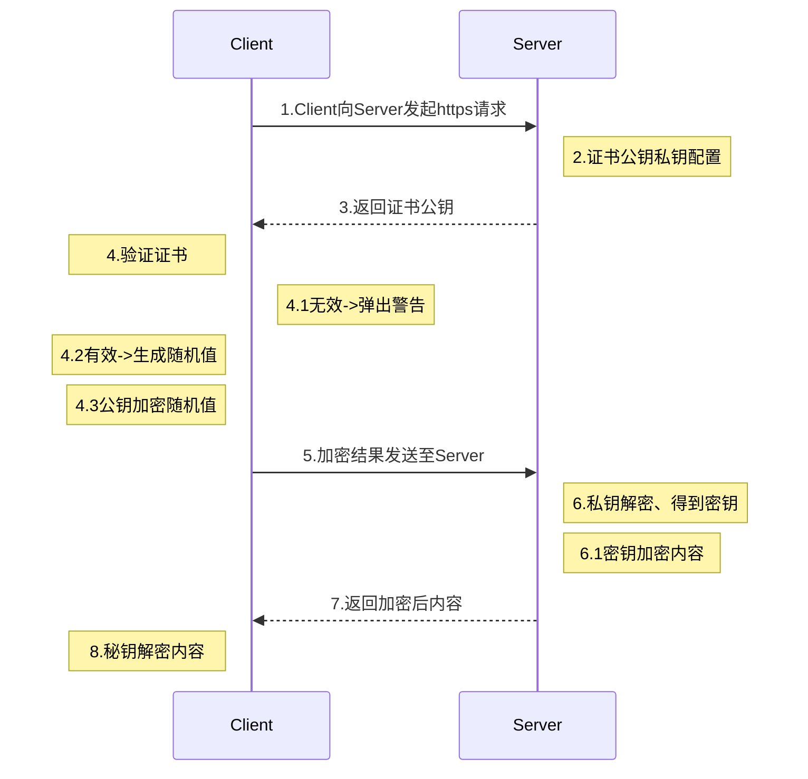

# HTTPS加密解密过程

## 过程图表

## 步骤解析：

* 图表算是比较清晰了、第1、3、5、7这个四个步骤是传输过程、没什么好说的。
* 第2步骤、实际就是咱们在证书机构购买的、并在Apache、Nginx等Web服务上的证书配置了。一般情况下购买到的证书都包含公钥、私钥两个文件，公钥文件记录的证书的颁发机构、过期时间和其他信息，私钥文件就相当于是钥匙了。

我认为这其中不能一眼看明白的步骤分别是第4、6、8步

* 第4步骤、客户端收到证书公钥、就会验证证书的有效性（这是由浏览器自动做的），证书无效时、浏览器会弹出警告信息。当证书有效、客户端就会自动生成一个随机值、然后用公钥证书加密这个随机值。相当于给这个随机值用公钥证书上了一把锁。

  客户端生成的随机值、可以理解为客户端的私钥。

* 第6步骤、服务端收到经过客户端用公钥证书加密的随机值后。服务端用私钥证书解密得到客户端传输过来的随机值、然后将返回内容和这个随机值进行对称加密、实际就是将信息和随机值通过莫衷算法混合在一起，这样就形成了加密、只有知道个随机值（也可以称为私钥）才能获取到内容。

  随机值是客户端生成的所以客户端能得到内容。而随机值是用公钥加密的、服务端有私钥可以解密、所以服务端也没问题。

  所以只要算法强大、私钥够复杂、就能最大程度保障数据安全

* 第8步骤、客户端收到服务端用前面自己生成的随机值加密的信息、自然可以安全的获取到内容了

这整个过程中、在1、3、5、7步骤中，就算有中间人截获到信息数据，但是没有任何一方的私钥、所以也无法解析到内容了

